# 🚀 Automatic Deployment Guide

This guide shows how to automatically deploy your MCRRC Race Series app to Vercel with database migrations.

## 📋 **Prerequisites**

- [x] Neon database created and connection string ready
- [x] Vercel account connected to GitHub
- [x] Project configured in Vercel

## 🔧 **Vercel Environment Variables**

Add these in **Vercel Dashboard → Settings → Environment Variables**:

```bash
# Required
DATABASE_URL=[your-neon-connection-string-here]
NODE_ENV=production

# Migration Security (use a secure random string!)
MIGRATION_SECRET=your-super-secure-migration-secret-here

# Optional
MCRRC_BASE_URL=https://mcrrc.org
```

> ⚠️ **Security**: Use a strong, unique `MIGRATION_SECRET` - this protects your migration endpoint!

## 🚀 **Deployment Options**

### **Option 1: Automatic Script** 
```bash
./scripts/deploy.sh
```

### **Option 2: Manual Steps**
```bash
# 1. Build and test locally
npm run build

# 2. Commit and push
git add -A
git commit -m "Deploy updates"
git push origin main

# 3. Vercel auto-deploys from GitHub
```

## 🔄 **Running Migrations**

### **After First Deployment:**

1. **Test connectivity:**
   ```bash
   curl https://your-app.vercel.app/api/health
   ```

2. **Run migrations via API:**
   ```bash
   curl -X POST https://your-app.vercel.app/api/migrate \
        -H "Content-Type: application/json" \
        -d '{"secret": "your-migration-secret"}'
   ```

3. **Verify tables created:**
   - Check Neon dashboard → SQL Editor
   - Run: `SELECT * FROM series;`

### **For Future Schema Changes:**

1. **Create migration:**
   ```bash
   npm run migrate:create -- add-new-feature
   ```

2. **Edit the migration files** in `migrations/`

3. **Deploy and run migration:**
   ```bash
   git add -A && git commit -m "Add new feature migration"
   git push origin main
   
   # After Vercel deploys:
   curl -X POST https://your-app.vercel.app/api/migrate \
        -H "Content-Type: application/json" \
        -d '{"secret": "your-migration-secret"}'
   ```

## 📊 **Monitoring**

### **Health Checks**
- **Frontend**: `https://your-app.vercel.app/`
- **API Health**: `https://your-app.vercel.app/api/health`
- **Test Endpoints**: 
  - `/api/runners`
  - `/api/races`
  - `/api/standings?year=2025`

### **Logs**
- **Vercel Dashboard** → **Functions** → **View Function Logs**
- **Migration logs** appear in `/api/migrate` function logs

## 🔧 **Troubleshooting**

### **Build Fails**
```bash
# Test locally first
npm run build
npm run lint
```

### **Database Connection Fails**
1. Check `DATABASE_URL` in Vercel environment variables
2. Test in Neon dashboard SQL editor first
3. Verify connection string format includes `?sslmode=require`

### **Migration Fails**  
1. Check function logs in Vercel dashboard
2. Verify `MIGRATION_SECRET` is correct
3. Test migration locally: `npm run migrate:status`

### **API Returns 500 Errors**
1. Check function logs in Vercel
2. Verify all environment variables are set
3. Test database connection: `/api/health`

## 🎯 **Deployment Workflow**

```mermaid
graph TD
    A[Code Changes] --> B[npm run build]
    B --> C[git commit & push]
    C --> D[Vercel Auto-Deploy]
    D --> E[Add Environment Variables]
    E --> F[POST /api/migrate]
    F --> G[Test /api/health]
    G --> H[🎉 Live!]
```



## ⚡ **Pro Tips**

- **Test locally first**: Always run `npm run build` before deploying
- **Migrations are one-way**: Create new migrations instead of editing existing ones
- **Environment variables**: Changes require redeployment to take effect
- **Database backups**: Neon automatically backups, but consider manual backups before major migrations
- **Staging environment**: Consider a separate Neon database for testing

## 🆘 **Need Help?**

1. Check **Vercel function logs** for API errors
2. Test **Neon connection** in their SQL editor
3. Verify **environment variables** are set correctly
4. Use `/api/health` to diagnose connection issues

---

**Next**: Once deployed, populate your database with initial runners and races! 🏃‍♂️
